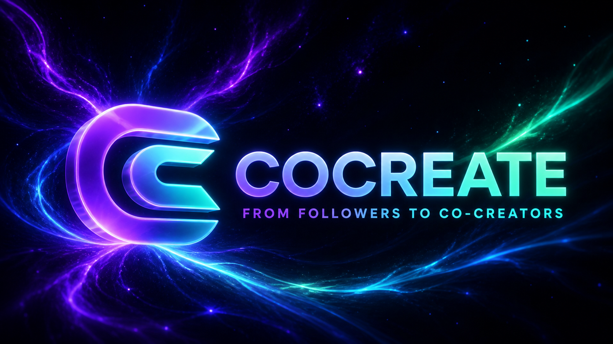

# CoCreate — from followers to co-creators

[](https://github.com/Angela-gp/CoCreate/actions/workflows/ci.yml)
[](LICENSE)
[](https://solana.com)
[](https://cocreate-demo.gelya-privalova.chatgpt.site)

> A Solana-powered crowdfunding platform where creators fund original work, supporters receive meaningful access, and campaign rules remain transparent.

[Live Demo](https://cocreate-demo.gelya-privalova.chatgpt.site) · [Architecture](docs/architecture.md) · [Solana Program](programs/cocreate/programs/creator-fund/src/lib.rs)

---



---

## Problem and Solution

### 1. Funding lacks trust

- **Problem:** supporters cannot easily verify where their money goes or what happens when a campaign misses its goal.
- **CoCreate:** campaign funds follow an escrow model with explicit payout and refund states.

### 2. Support is one-sided

- **Problem:** ordinary donations rarely give the audience continued access or influence.
- **CoCreate:** every contribution can unlock a Creator Pass with project access and voting rights.

### 3. Payment flows are fragmented

- **Problem:** creators combine transfers, spreadsheets, community chats, and separate voting tools.
- **CoCreate:** campaigns, SOL/USDC contributions, passes, voting, distribution, and transaction history live in one product.

### 4. Blockchain tools are difficult for new users

- **Problem:** wallets and network terminology can interrupt the creator experience.
- **CoCreate:** Wallet Standard supports familiar wallets, while Demo mode presents the complete journey without requiring tokens or an extension.

---

## Why Solana

- **Fast confirmation** — suitable for interactive support and voting flows.
- **Low transaction cost** — makes small contributions practical.
- **Wallet Standard** — supports Phantom, Backpack, Solflare, and other compatible wallets.
- **SPL tokens** — enables both SOL and USDC campaign models.
- **Programmable escrow** — Anchor instructions encode contribution, settlement, refund, pass, and voting rules.
- **Public verification** — Devnet transactions can be inspected in Solana Explorer.

---

## Summary of Features

- Phantom, Backpack, and Solflare through Wallet Standard
- Local Demo wallet and Demo / Devnet switching
- Wallet-signed Devnet transactions and Solana Explorer links
- Devnet SOL airdrop
- SOL and USDC campaigns
- Successful campaign payout with a 5% platform fee
- Failed campaign refunds
- Four Creator Pass levels
- Pass-weighted project voting
- Transaction history and a persistent local demonstration ledger
- Creator studio and supporter dashboard
- Guided campaign creation

---

## Blockchain Model

The Anchor program defines the financial rules and PDA account model.

| Instruction | Purpose |
| --- | --- |
| `initialize_platform` | Configure the platform treasury and fee |
| `create_campaign_native` / `create_campaign_spl` | Create a SOL or SPL campaign |
| `contribute_native` / `contribute_spl` | Lock a contribution in campaign escrow |
| `finalize` | Resolve the campaign after its goal or deadline |
| `settle_native` / `settle_spl` | Distribute a successful campaign and charge 5% |
| `refund_native` / `refund_spl` | Return funds from an unsuccessful campaign |
| `create_poll` / `cast_vote` | Create a poll and record a weighted vote |

PDA accounts: `Platform`, `Campaign`, `Vault`, `Contribution`, `CreatorPass`, `Poll`, and `VoteRecord`.

Program ID: `99exy144EKNqoRWKn9S1Eu3AvySgPnwrbuSrX5zrxdsi`

> **Devnet status:** the current website sends real wallet-signed SOL/SPL transfers with a memo and records the product flow in the client ledger. The Anchor source and integration tests are included and compile successfully, but the program has not yet been deployed and connected to the frontend. Mainnet use requires deployment, client instruction integration, and an independent security audit.

---

## Tech Stack

| Layer | Technology |
| --- | --- |
| On-chain program | Rust · Anchor 0.30.1 |
| Solana client | `@solana/web3.js` · SPL Token |
| Wallets | Wallet Adapter · Wallet Standard |
| Frontend | React 18 · TypeScript · Vite · Tailwind CSS |
| State | Zustand persistent ledger |
| Testing | Node test runner · TypeScript · Cargo check |
| Hosting | OpenAI Sites |

---

## Architecture

```text
Creator / Supporter
        │
        ├── Demo wallet ───────────────> Local persistent ledger
        │
        └── Phantom / Backpack / Solflare
                         │ wallet signature
                         v
                   Solana Devnet
                         │
             ┌───────────┴───────────┐
             │                       │
       SOL / SPL + memo       Anchor CoCreate program
       (current website)      (source ready for deploy)
                                     │
                   Campaign PDA ─ Vault PDA ─ Contributions
                                     │
                         Passes · Polls · Payouts · Refunds
```

See [docs/architecture.md](docs/architecture.md) for the full trust boundaries and account model.

---

## Repository Structure

```text
.github/workflows/ci.yml             CI checks
assets/                              Project artwork
backend/src/                         Shared domain helpers
docs/                                Product, API, architecture, roadmap
frontend/                            React website and wallet integration
programs/cocreate/                   Anchor workspace
  programs/creator-fund/             Solana program
  tests/                             Anchor integration tests
scripts/                             Deployment helpers
tests/                               Client model tests
```

The repository follows the reference submission layout while retaining the nested Anchor workspace required by the imported program. Android remains only as a technical reference; private keypairs, dependencies, generated builds, and local ledgers are excluded from Git.

---

## Quick Start

**Prerequisites:** Node.js 22+ and npm.

```bash
git clone https://github.com/Angela-gp/CoCreate.git
cd CoCreate/frontend
npm ci
npm run dev
```

Open the local URL printed by the development server.

### Validate the website

```bash
cd frontend
npm run test:model
npm run typecheck
npm run build
```

### Validate the Solana program

Install Rust, Solana CLI, Anchor CLI 0.30.1, and Yarn, then run:

```bash
cd programs/cocreate
yarn install
anchor build
anchor test
```

An optional custom RPC endpoint can be set with `VITE_SOLANA_RPC_URL`; see `.env.example`.

---

## Roadmap

- [x] Responsive creator and supporter interface
- [x] Demo wallet and persistent demonstration ledger
- [x] Wallet Standard and Devnet transaction signing
- [x] SOL/USDC, Creator Pass, voting, payout, and refund flows
- [x] Anchor escrow program source and integration tests
- [ ] Deploy and initialize the Anchor program on Devnet
- [ ] Replace transfer + memo with direct Anchor instructions
- [ ] Read campaign state from PDA accounts and index program events
- [ ] Complete an independent security audit before mainnet

Full roadmap: [docs/roadmap.md](docs/roadmap.md)

---

## Resources

- [Live application](https://cocreate-demo.gelya-privalova.chatgpt.site)
- [Two-minute presentation script](docs/product.md)
- [Product architecture](docs/architecture.md)
- [API and program reference](docs/api.md)
- [Contribution guide](CONTRIBUTING.md)

---

## License

MIT — see [LICENSE](LICENSE).
